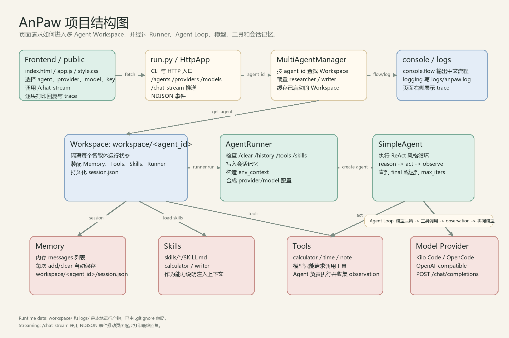
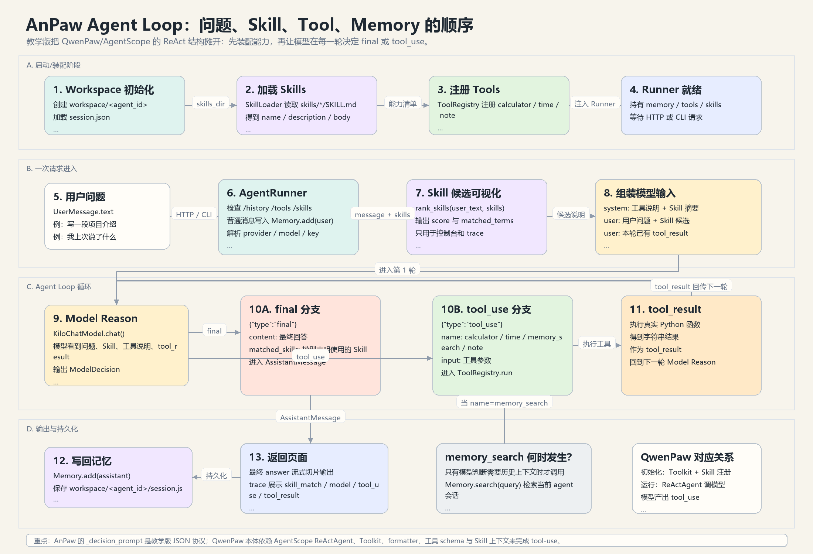

# AnPaw

AnPaw 是一个用于学习 QwenPaw 智能体运行链路的精简版项目。

它不是生产版聊天客户端，也不是要完整复刻 QwenPaw。它的目标是把“用户消息 -> Provider/Model -> Agent Loop -> Skill/Tool -> Observation -> Final”的核心结构做成一个容易读、容易改、容易实验的小样本。

它可以接真实云端模型，但不依赖 AgentScope/FastAPI/MCP，也不追求生产完整度，只保留最核心的形状：

```text
用户消息
-> App/CLI 入口
-> MultiAgentManager 找 Workspace
-> AgentRunner 处理命令、会话、上下文
-> SimpleAgent 装配模型、skills、tools
-> agent-loop: 模型决定 tool_use/final -> 工具执行 -> tool_result 回给模型
-> 返回最终回答
```

当前页面还额外演示了：

- 三个预置智能体：`default`、`researcher` 和 `writer`
- 按 `agent_id` 复用不同 Workspace
- 每个 Workspace 用 `session.json` 持久化会话
- 页面端流式打印最终回复
- 控制台中文流程输出
- 右侧结构化 trace 和文件日志查看

## 结构图



## Agent Loop 细节图



## 运行

在 PowerShell 里：

```powershell
cd E:\.Aproject\anpaw
python -m pip install -r requirements.txt
python run.py "计算 2 + 3 * 4"
python run.py "使用 writer skill 写一段项目介绍"
python run.py "/skills"
python run.py --server
```

打开页面：

```text
http://127.0.0.1:8095/
```

页面顶部可以选择智能体：

| Agent | agent_id | 用途 |
| --- | --- | --- |
| Default | `default` | 默认通用智能体，不偏向特定任务场景 |
| Researcher | `researcher` | 偏分析、问答和工具调用的通用智能体 |
| Writer | `writer` | 偏介绍、总结、改写和结构化写作的智能体 |

启动服务时会预加载这三个 Workspace，后续请求会按 `agent_id` 复用对应的 Workspace。每个 Workspace 都有自己的目录和会话文件：

```text
workspace/default/session.json
workspace/researcher/session.json
workspace/writer/session.json
```

`/history` 读取的是当前 agent 对应的会话记忆；`/clear` 会清空当前 agent 的 `session.json`。

页面支持两个云端 Provider：

| Provider | Base URL | 模型列表来源 | API Key 环境变量 |
| --- | --- | --- | --- |
| Kilo Code | `https://api.kilo.ai/api/gateway` | 学习版固定 7 个云端模型 | `KILO_API_KEY` |
| OpenCode | `https://opencode.ai/zen/go/v1` | 学习版固定 4 个云端模型 | `OPENCODE_API_KEY` |

注意：Kilo Gateway 的 `/models` 会返回数百个聚合模型。AnPaw 是学习项目，为了对应云端提供商卡片和避免干扰理解，这里只保留 OpenCode 4 个、Kilo Code 7 个，共 11 个模型。

默认模型：

```text
provider: Kilo Code
model: nvidia/nemotron-3-ultra-550b-a55b:free
```

学习版模型清单：

```text
OpenCode
- DeepSeek V4 Flash: deepseek-v4-flash-free
- Mimo V2.5: mimo-v2.5-free
- Nemotron 3 Ultra: nemotron-3-ultra-free
- Nemotron 3 Super: nemotron-3-super-free

Kilo Code
- Kilo Auto (Free Router): kilo-auto/free
- Nemotron 3 Ultra 550B: nvidia/nemotron-3-ultra-550b-a55b:free
- Nemotron 3 Super 120B: nvidia/nemotron-3-super-120b-a12b:free
- Poolside Laguna M.1: poolside/laguna-m.1:free
- Poolside Laguna XS.2: poolside/laguna-xs.2:free
- Step 3.7 Flash: stepfun/step-3.7-flash:free
- Nex N2 Pro: nex-agi/nex-n2-pro:free
```

OpenCode 和 Kilo Code 的免费模型默认无需 Key。你可以直接在页面选择模型并发送消息。

如果你想使用自己的额度或减少公共免费池限流，可以把 Key 放进环境变量，或写到 `.env`：

```powershell
$env:KILO_API_KEY="你的 key"
$env:OPENCODE_API_KEY="你的 key"
python run.py --server
```

也可以在页面右上角临时填写 API Key。没有 Key 时，AnPaw 会不带 `Authorization` 头直接请求免费 Provider；如果公共池限流，会在页面展示云端错误。
页面会把临时填写的 Key 存在浏览器 localStorage，方便重复实验；服务端不会写入这个 Key。

复制 `.env.example` 为 `.env` 后也可以长期配置：

```powershell
Copy-Item .env.example .env
notepad .env
python run.py --server
```

启动 HTTP 服务后，可以请求：

```powershell
Invoke-RestMethod -Method Post http://127.0.0.1:8095/chat `
  -ContentType "application/json" `
  -Body '{"agent_id":"researcher","message":"列出 skills"}'
```

页面聊天默认走流式接口：

```powershell
Invoke-WebRequest -Method Post http://127.0.0.1:8095/chat-stream `
  -ContentType "application/json" `
  -Body '{"agent_id":"writer","message":"写一段项目介绍"}'
```

`/chat-stream` 返回 `application/x-ndjson`，一行一个事件：

```text
status   后端阶段状态
chunk    最终回复文本片段
trace    完整结构化 trace
done     本轮结束
error    后端异常
```

## 读代码顺序

1. `run.py`：入口，模拟 CLI / HTTP。
2. `anpaw/console.py`：控制台中文流程输出。
3. `anpaw/manager.py`：多 Agent 管理，按 agent_id 查找或懒加载 workspace。
4. `anpaw/workspace.py`：单 Agent 工作区，组合 runner、memory、skill loader。
5. `anpaw/runner.py`：一次请求的编排层，处理 `/clear`、`/history`、`/skills`。
6. `anpaw/agent.py`：真正的 agent-loop。
7. `anpaw/model.py`：OpenAI-compatible 云端模型客户端和决策 JSON 解析。
8. `anpaw/tools.py`：工具注册和执行。
9. `anpaw/skills.py`：读取 `skills/*/SKILL.md`。
10. `public/`：实验页面，展示聊天、流式回复和运行轨迹。

## Provider 学习版设计

真实 QwenPaw 的 Provider/Model 层会处理很多事情：Provider 注册、模型列表、API Key、base URL、模型能力、错误转换、token 用量、插件 Provider 等。

AnPaw 只保留学习所需的最小骨架：

```text
ProviderSpec
-> list_models(provider)
-> ModelConfig(provider, base_url, model, api_key)
-> KiloChatModel.chat(...)
-> AgentRunner 把 ModelConfig 注入 SimpleAgent
```

代码位置：

| 文件 | 作用 |
| --- | --- |
| `anpaw/providers.py` | Provider 注册表，维护学习版 OpenCode 4 个 / Kilo Code 7 个模型清单。 |
| `anpaw/config.py` | 从页面、环境变量、`.env` 合成一次运行用的 `ModelConfig`。 |
| `anpaw/model.py` | 统一用 OpenAI-compatible `POST /chat/completions` 调云端模型。 |
| `public/app.js` | 页面选择 agent/provider/model/key，并调用 `/model-test`、`/chat-stream`。 |

这意味着它适合用来理解 Provider 思路，但没有做生产级能力缓存、限流、计费展示、模型能力矩阵、密钥加密或多用户隔离。模型清单也是教学用的 11 个云端模型，而不是 Kilo Gateway/OpenCode 后端可能暴露的所有聚合模型。免费无 Key 调用可能遇到公共池限流，这属于 Provider 侧状态，不是 AnPaw 本地错误。

## 和 QwenPaw 的对应关系

| AnPaw | QwenPaw |
| --- | --- |
| `run.py` / `HttpApp` | FastAPI + 控制台/渠道/CLI 入口 |
| `MultiAgentManager` | `src/qwenpaw/app/multi_agent_manager.py` |
| `Workspace` | `src/qwenpaw/app/workspace/workspace.py` |
| `AgentRunner` | `src/qwenpaw/app/runner/runner.py` |
| `SimpleAgent` | `src/qwenpaw/agents/react_agent.py` 中的 `QwenPawAgent` |
| `KiloChatModel` | Provider/Model 层 |
| `ToolRegistry` | AgentScope Toolkit + 内置工具/MCP 工具 |
| `SkillLoader` | skill_system + `SKILL.md` |

注意：AnPaw 的 `_decision_prompt()` 是教学版协议，用严格 JSON 模拟
`tool_use -> tool_result -> final`。QwenPaw 本体不是只靠这一段 prompt
粗暴判断工具；它基于 AgentScope `ReActAgent`、Toolkit、formatter 和模型
原生/兼容的 tool-use 消息工作。启动时 QwenPaw 会注册内置工具、MCP 工具和
Skill，运行时模型在 ReAct 循环中根据系统提示、Skill 内容、工具 schema、
上下文和 memory/tool result 决定是否发起工具调用。

## 学习重点

`AgentRunner` 不直接“聪明”，它负责把一次请求整理成 agent 能运行的环境。

`Memory` 负责保存当前 Workspace 的会话消息。运行时它仍然是一个内存列表，但每次新增或清空消息都会同步写入：

```text
workspace/<agent_id>/session.json
```

这让不同 agent 的会话文件彼此隔离，也让服务重启后还能用 `/history` 看到之前的会话。

当前版本还把记忆检索注册成了 `memory_search` 工具。Runner 不会把整段历史自动塞进每次 prompt；如果模型判断用户问题需要历史上下文，它会先返回 `tool_use` 调用 `memory_search`，Agent 执行后把 `tool_result` 交回下一轮模型。这比简单拼 prompt 更接近 QwenPaw/AgentScope 的 ReAct 工具调用形状。

`SimpleAgent` 也不直接“知道所有事”，它只拿到当前用户消息、本轮 `tool_result`、tools、skills 和模型客户端，并反复执行：

```text
reason -> tool_use -> tool_result -> reason
```

真实项目复杂，是因为每个方块都有生产级能力：原生 token 流式、鉴权、多渠道、MCP、模型供应商、安全审批、上下文压缩、持久化、热重载。AnPaw 把这些先拿掉，只留下骨架。

当前 `/chat-stream` 是教学版流式：后端先跑完一次 Agent Loop，再把最终答案切成片段推给页面逐步打印。它改善页面体验，但还不是云端模型 token 级原生流式。真正的 token 流式需要让 `KiloChatModel.chat()` 使用 provider 的 `stream: true`，并解析 SSE。

## Trace 说明

页面右侧“运行链路”分成两层：顶部胶囊是生命周期摘要，下面的事件列表会分成“服务启动期”和“单次请求期”两块详情。

`python run.py --server` 启动时会先预加载页面可选的 `default`、`researcher`、`writer` 三个 Workspace：

```text
workspace init
-> load memory
-> register tools
-> load skills
-> create runner
-> workspace start
-> cache workspace
```

用户发送消息后，页面收到的是一次请求级 trace：

```text
entry
-> manager: 按 agent_id 查找 Workspace
-> workspace: 通常复用启动期已加载 workspace
-> runner: 处理命令、会话、模型配置、环境上下文
-> skill_match: 针对当前用户消息生成本轮 Skill 候选
-> agent-loop/model/tool_use/tool_result/final
```

如果请求的是预加载 agent，例如 `default`、`researcher`、`writer`，第一条消息通常会看到：

```text
workspace: reuse loaded workspace
```

只有请求未预加载过的 `agent_id`，才会在这次请求里触发懒加载：

```text
manager: workspace not loaded, create it lazily
workspace: start workspace services
```

之后同一个 `agent_id` 的请求都会复用缓存：

```text
workspace: reuse loaded workspace
```

Trace 现在比早期版本更细，通常会覆盖这些学习节点：

```text
startup          服务启动、预加载入口
startup_agent    预加载某个预置 agent
manager          根据 agent_id 查找 Workspace；必要时懒加载
workspace_init   创建 Workspace 对象和目录
memory_load      加载该 Workspace 的 session.json
tool_register    注册内置工具
skill_load       读取 skills/*/SKILL.md
runner_ready     创建 AgentRunner
workspace        start workspace services；请求期也会显示复用缓存
entry            请求进入 AnPaw
runner           检查命令、构造 env context、合成 ModelConfig
memory           写入用户消息 / 助手消息
provider         选择 provider、base_url、model、是否带 Key
agent            初始化 SimpleAgent runtime
agent-loop       第 N 轮 reason/tool_use/tool_result 循环
skill_match      本地生成 Skill 候选，展示分数和匹配词
model-http       云端 chat/completions 请求、原始响应预览、错误
model            模型决策：final 或 tool_use
tool_use         工具调用名称和参数
tool_result      工具结果送回模型
final            最终回复返回给用户
```

## 控制台和后端日志

控制台用于看中文流程线，例如：

```text
[10:47:28.713 pid=1220] [Runner] 命中内置命令，跳过模型和工具循环 | command='/tools'
```

文件日志写入：

```text
E:\.Aproject\anpaw\logs\anpaw.log
```

两者分工不同：

- 控制台：适合贯通当前请求的代码路径。
- `logs/anpaw.log`：适合排查历史请求、模型错误和后端异常。

如果服务是隐藏窗口启动的，可以用页面右侧的“日志”按钮查看最近日志，也可以直接请求：

```powershell
Invoke-RestMethod http://127.0.0.1:8095/logs?lines=80
```

页面右侧 trace 更适合学习单次请求的结构化链路；`logs/anpaw.log` 更适合排查服务端发生了什么。

## License

MIT License. See [LICENSE](./LICENSE).
